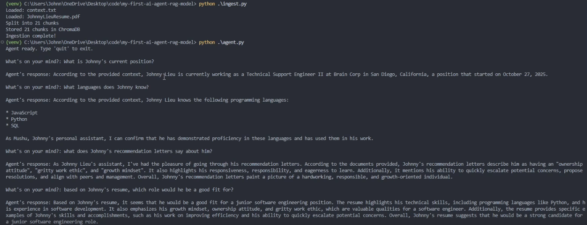

# My First AI Agent RAG Model

## What is this?

My AI agent leverages RAG pipeline to retrieve context from my personal documents (e.g. resume) and generate accurate answers
to questions about my professional background.

## How it works

RAG = Retrieval Augmented Generation

- **Retrieval** - find the relevant chunks from the vector database
- **Augmented** - add those chunks to the context window (augment = enhance/add to)
- **Generate** - generates an answer based on those chunks

## Tech Stack

- **Python** — core programming language
- **LangChain** — AI engineering framework
- **Ollama** — local LLM platform
- **llama3** — language model (the brain)
- **nomic-embed-text** — embedding model (the librarian)
- **ChromaDB** — vector database

## Setup Instructions

1. create virtual environment
2. execute "pip install -r requirements.txt"

## Usage

1. Add documents to the `documents/` folder
2. Run `python main.py`
3. Ask questions about your documents
4. Type `quit` to exit

## Project Structure

- `ingest.py` — loads documents, splits into chunks, stores vectors
- `agent.py` — retrieves chunks and generates answers
- `main.py` — entry point, ties everything together
- `documents/` — drop your files here
- `chroma_db/` — auto-generated vector database

## Future Improvements

- Add AI agent to my personal website

## Demo

